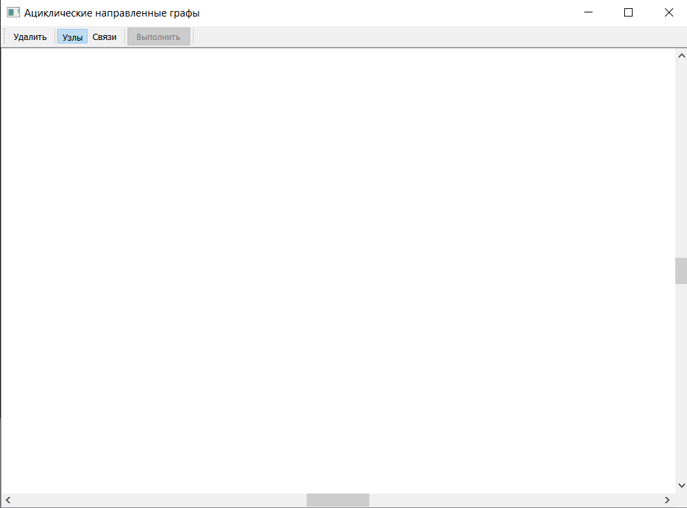
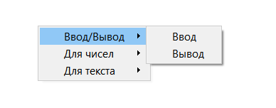
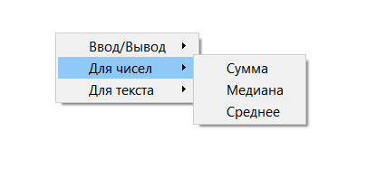
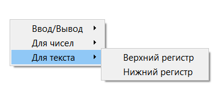
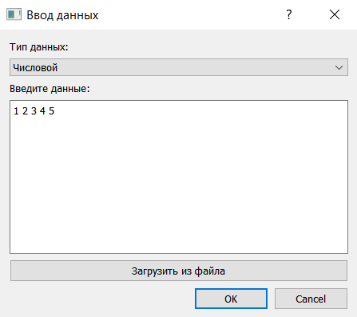
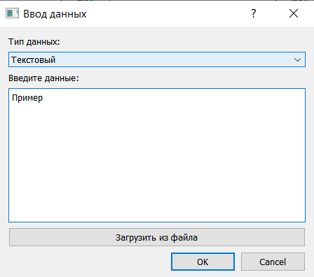
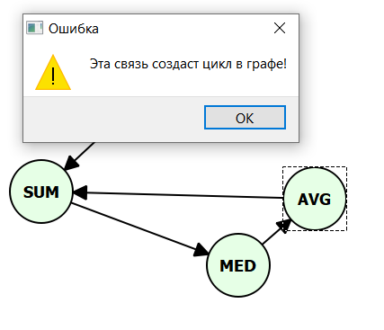
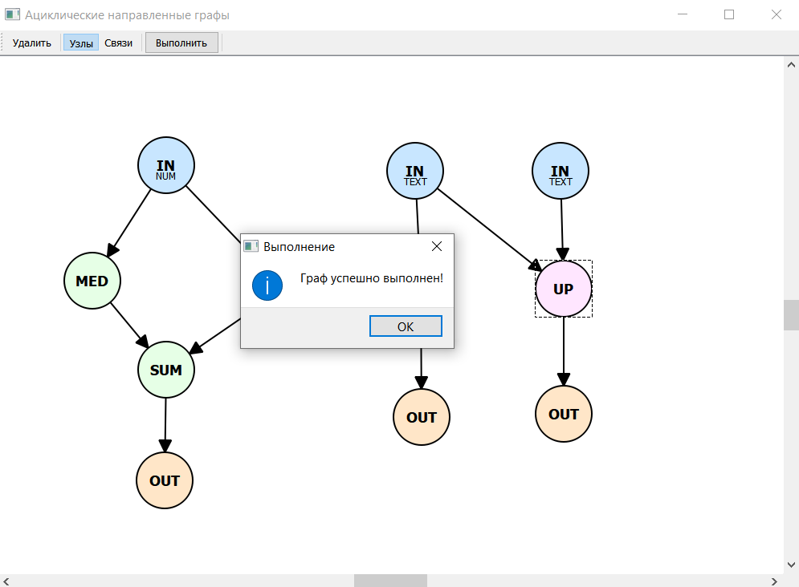

# DAG Editor

## Задание
Реализовать программу в виде оконного приложения, реализующего работу с направленными ациклическими графами.
Реализовать ввод графа через графическое окно и выполнение графа над входными данными, вывод результата на экран.
Функции для чисел - сумма, среднее, медиана, для строк - приведение к нижнему или верхнему регистру.
Язык программирования - C++. Разрешается использовать любые доступные фреймворки для построения оконных приложений на C++. Запрещается использовать готовые библиотечные решения.

## Описание

Программа для создания и выполнения направленных ациклических графов (DAG). Позволяет визуально строить графы, вводить данные и выполнять математические и текстовые операции.

*Основное окно программы с панелью инструментов и сценой для графа*

## Функциональные возможности

### 7 типов узлов: INPUT, OUTPUT, SUM, MEDIAN, AVERAGE, TO UPPER, TO LOWER
| | | |
|-|-|-|
| **Ввод/Вывод** | **Числовые узлы** | **Текстовые узлы** |
|  |  |  |

### Поддержка числовых и текстовых данных
| | |
|-|-|
| **Ввод чисел** | **Ввод текста** |
|  |  |

### Проверка на циклы (DAG)
  
  
*При попытке создать связь, образующую цикл, появляется сообщение об ошибке*

  
## Пример графа
  
  
*После успешного выполнения графа можно заходить в узлы вывода и проверять результаты*

## Требования

- Qt 5.14.2 или выше
- CMake 3.10 или выше
- Компилятор C++11 (MinGW или MSVC)

## Клонирование и сборка

1. Клонирование репозитория
```
git clone https://github.com/BoatCherChill/DAG.git
cd DAG
```

2. Сборка проекта
```
mkdir build && cd build
cmake ..
cmake --build .
```
3. Запуск приложения

```
# Linux / macOS
./DAG

# Windows
./DAG.exe
```
## Архитектура приложения
```
MainWindow (контроллер)
    - DiagramScene (сцена)
        - VisualNode (визуальный узел)
        - Arrow (стрелка связи)
    - Graph (логика графа)
        - Node (структура узла)
```
Классы:

- MainWindow - Главное окно, обработка действий пользователя, синхронизация
- DiagramScene - Графическая сцена, обработка событий мыши
- VisualNode - Визуальный узел, ввод данных, отрисовка
- Arrow - Визуальная стрелка
- Graph - Логика графа, вычисления, проверка циклов

## Интерфейс программы
```
Кнопка "Узлы" - Режим перемещения узлов
Кнопка "Связи" - Режим создания связей
Кнопка "Удалить" - Удаление выделенного элемента
Кнопка "Выполнить" - Запуск вычислений графа
```
## Инструкция по использованию

1. Создание узла: ПКМ на пустом месте -> выбор типа узла
2. Ввод данных: дважды кликнуть на INPUT -> выбрать тип (числа/текст) -> ввести данные
3. Создание связи: кнопка "Связи" -> зажать ЛКМ на первом узле -> перетащить мышь до второго узла -> отпустить ЛКМ
4. Выполнение: кнопка "Выполнить" 
5. Просмотр результата: дважды кликнуть на OUTPUT

## Структура проекта
```
DAG/
- CMakeLists.txt      # Файл сборки
- main.cpp            # Точка входа
- mainwindow.h/cpp    # Главное окно
- diagramscene.h/cpp  # Графическая сцена
- visualnode.h/cpp    # Визуальный узел
- arrow.h/cpp         # Стрелка
- graph.h/cpp         # Логика графа
- README.md           # Документация
```
